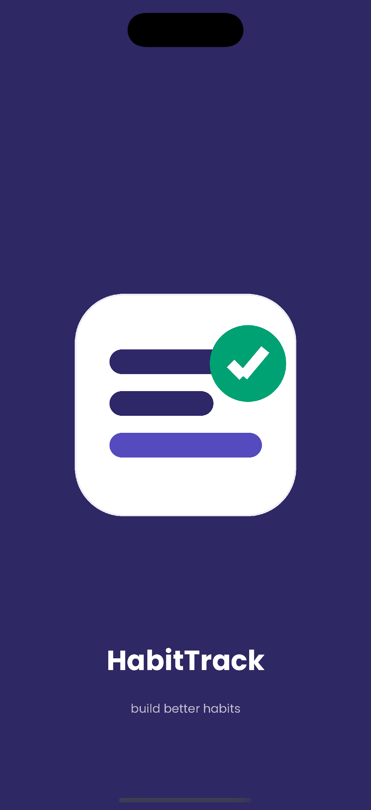
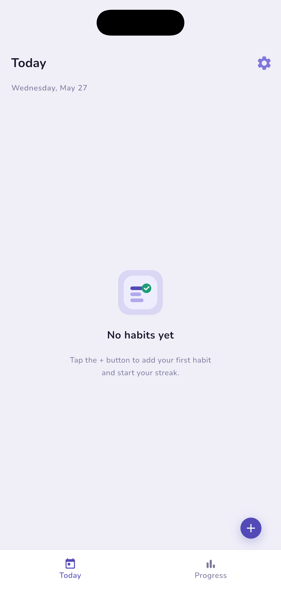
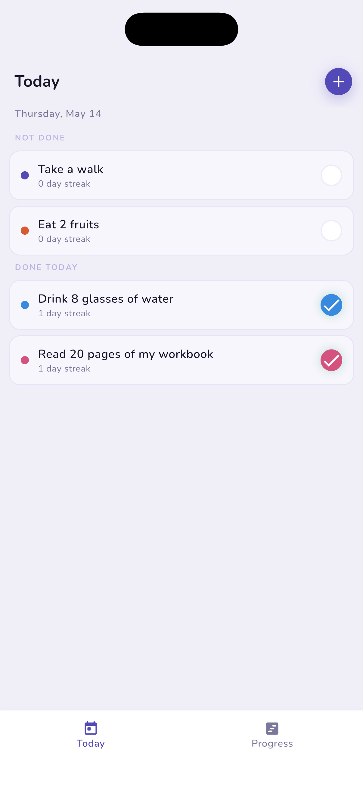
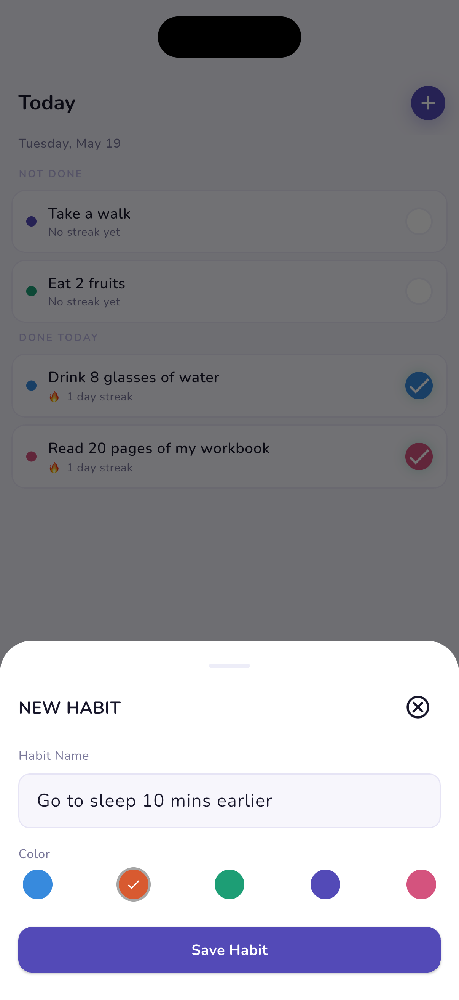
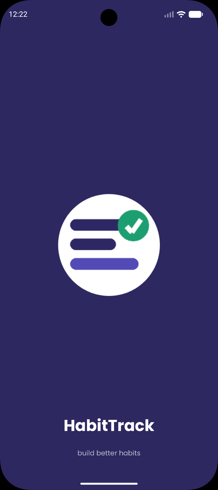
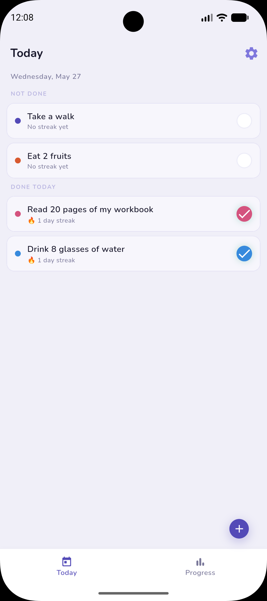
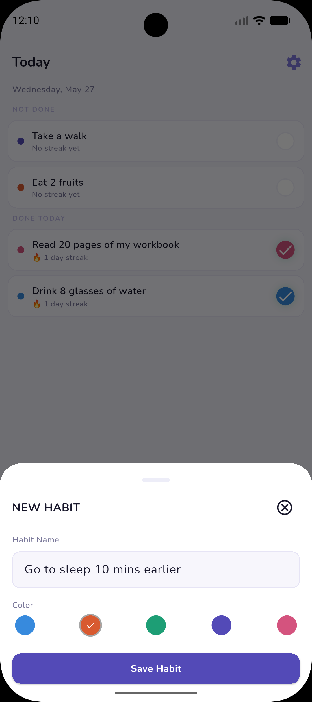

# HabitTrack

A lightweight, offline-first habit tracking app built with Flutter — running on both iOS and Android.

## Screenshots

| | Splash | Today (Empty) | Today (Active) | Add Habit |
|---|:---:|:---:|:---:|:---:|
| **iOS** |  |  |  |  |
| **Android** |  |  |  |  |

## Features

- ✅ Track daily habits and maintain streaks
- ✅ Color-coded habit cards for quick visual scanning
- ✅ Separate "Not Done" / "Done Today" sections, updated in real time
- ✅ Add habits via a BottomSheet with name and color picker
- ✅ Polished splash screen on iOS and Android (including Android 12+ adaptive splash)
- ✅ Custom launcher icons across both platforms
- ✅ Fully offline — no account or login required
- ✅ Cross-platform: iOS and Android from a single codebase

## Tech Stack

| Layer | Choice | Notes |
|---|---|---|
| Language | Dart / Flutter | SDK `^3.11.5` |
| State management | Provider | MVVM — `HabitViewModel` is the single source of truth |
| Persistence | sqflite | Local SQLite, no backend |
| Fonts | Nunito (Google Fonts) | 400 / 500 / 600 / 700 weights |
| Splash | flutter_native_splash | Android 12+ adaptive splash configured |
| Icons | flutter_launcher_icons | 1024px source icon |

## Architecture

MVVM using Provider. `HabitViewModel` extends `ChangeNotifier` and is the
single source of truth for habit state. Screens consume it via
`Consumer<HabitViewModel>` — no business logic in widgets.
Persistence is handled by sqflite through a dedicated repository layer,
keeping the data layer cleanly separated from the UI.

```
habittrack/
├── assets/
│   ├── fonts/          # Nunito 400–700
│   ├── icon/           # 1024px launcher icon source
│   ├── images/
│   └── splash/         # Splash assets, Android 12+ adaptive
├── docs/               # README screenshots
├── lib/
│   ├── core/
│   │   ├── constants/  # Colors, text styles, dimensions, strings
│   │   └── utils/      # Helper utilities
│   ├── data/
│   │   ├── database/   # DatabaseHelper (sqflite)
│   │   ├── models/     # Habit
│   │   └── repositories/
│   ├── viewmodels/     # HabitViewModel (ChangeNotifier)
│   └── views/
│       ├── add_edit_habit/ # AddEditHabitBottomSheet
│       └── home/       # HomeScreen, TodayScreen, widgets
├── pubspec.yaml
└── README.md
```

## Roadmap

- [ ] Progress charts and streak history visualization
- [ ] Habit edit and delete
- [ ] Daily reminders / local notifications
- [ ] Dark mode support
- [ ] Riverpod branch — alternate state management implementation for comparison

## Getting Started

```bash
flutter pub get
flutter run
```

Requires Flutter 3.x and Dart 3.x.