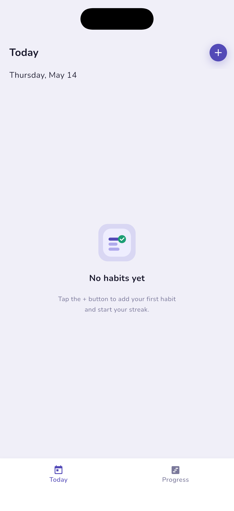
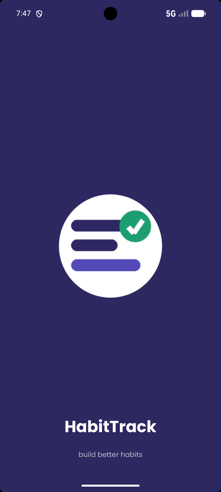
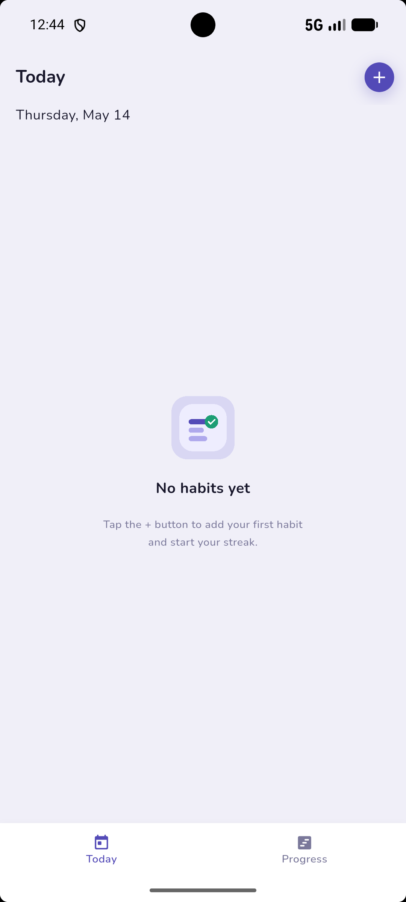

# HabitTrack

A lightweight habit tracking app built with Flutter.

> 🚧 **In progress** — data layer and core navigation are complete;
> habit card UI and add/edit sheet are actively being built.

## Screenshots

| | Splash | Today |
|---|:---:|:---:|
| **iOS** |  |  |
| **Android** |  |  |

## Features

- Track daily habits and maintain streaks
- Color-coded habit cards for quick visual scanning
- Progress view to review habit history
- Fully offline — no account or login needed
- Cross-platform: iOS and Android

## Tech Stack

| Layer | Choice |
|---|---|
| Language | Dart / Flutter |
| State management | Provider (MVVM) |
| Persistence | sqflite |
| Architecture | MVVM — `HabitViewModel` is the single source of truth |

## Architecture

MVVM using Provider. `HabitViewModel` extends `ChangeNotifier` and is the
single source of truth for habit state. Screens consume it via
`Consumer<HabitViewModel>` — no business logic in widgets.
Persistence is handled by sqflite via a repository layer.
```
lib/
├── core/           # Theme, colors, text styles, constants
├── data/
│   ├── database/   # DatabaseHelper (sqflite)
│   ├── models/     # Habit
│   └── repositories/
├── viewmodels/     # HabitViewModel
└── views/
└── home/       # HomeScreen, TodayScreen, ProgressScreen, widgets
```
## Getting Started

```bash
flutter pub get
flutter run
```

Requires Flutter 3.x and Dart 3.x.