# HabitTrack

[](https://github.com/eomapps/habittrack_flutter/actions/workflows/main.yaml)

A lightweight, offline-first habit tracking app built with Flutter — running on both iOS and Android.

## Screenshots

**Light**

| | Splash | Home (Empty) | Home (Active) | Add Habit |
|---|:---:|:---:|:---:|:---:|
| **iOS** |  |  | 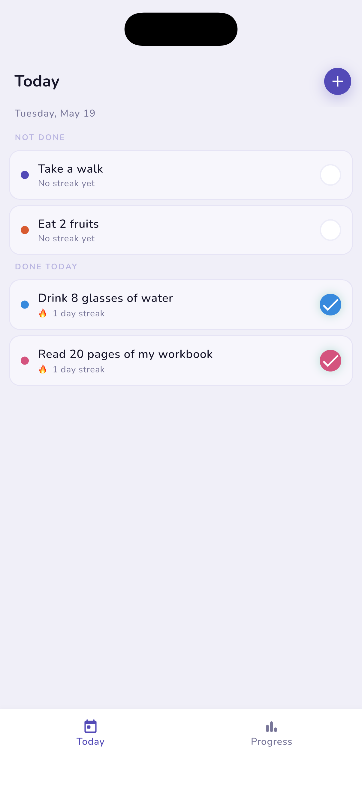 |  |
| **Android** |  | 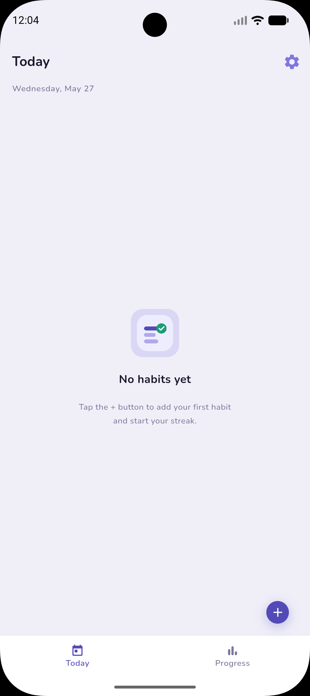 |  |  |

| | Edit Habit | Progress | Settings |
|---|:---:|:---:|:---:|
| **iOS** | 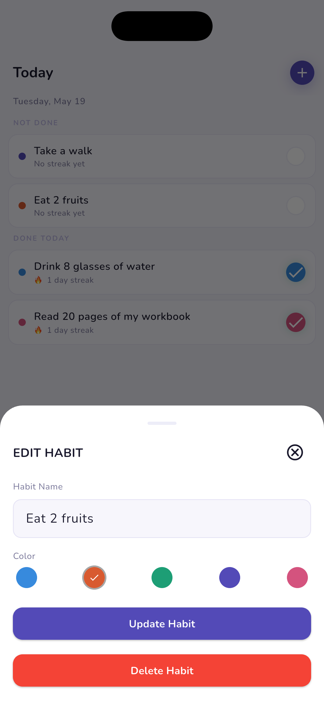 | 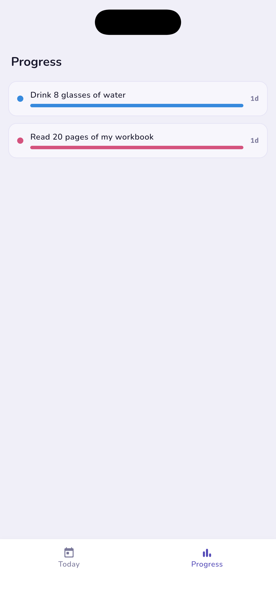 | 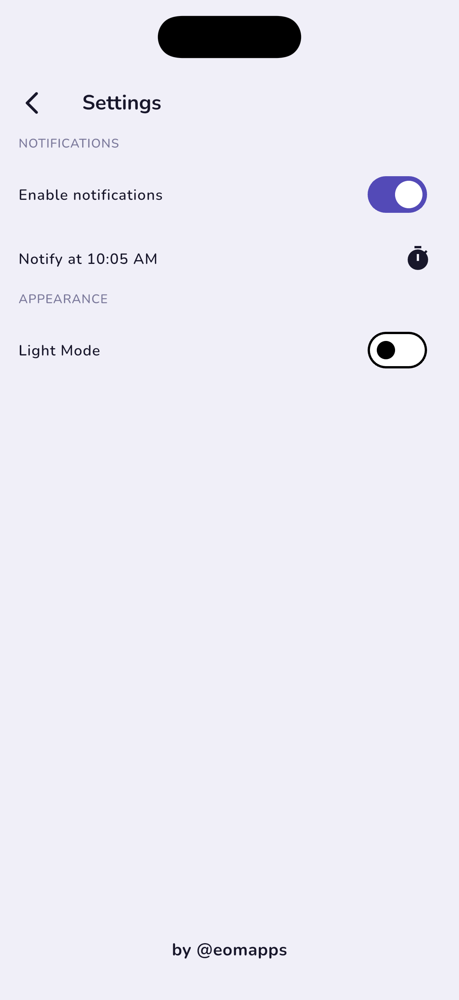 |
| **Android** | 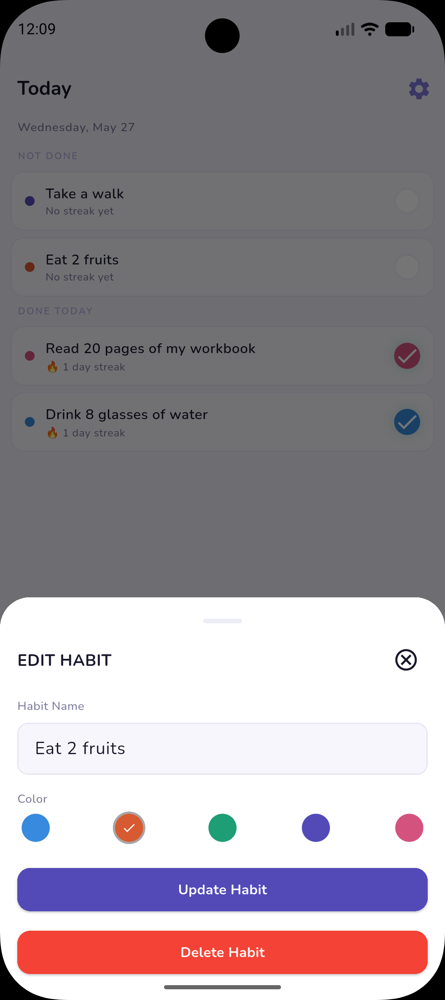 | 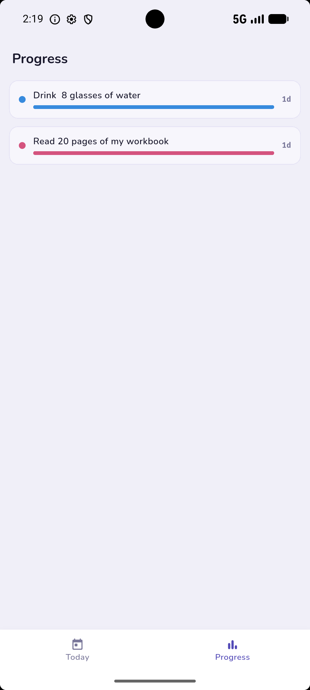 | 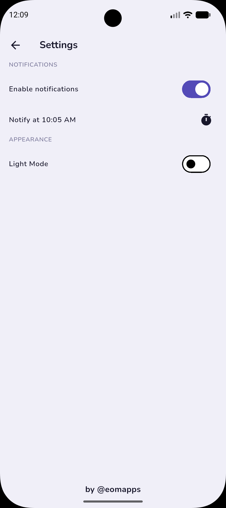 |

**Dark**

| | Home (Active) | Add Habit | Progress |
|---|:---:|:---:|:---:|
| **iOS** | 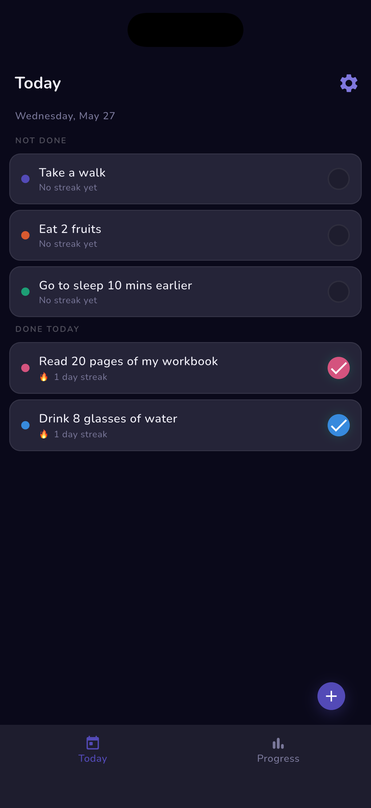 | 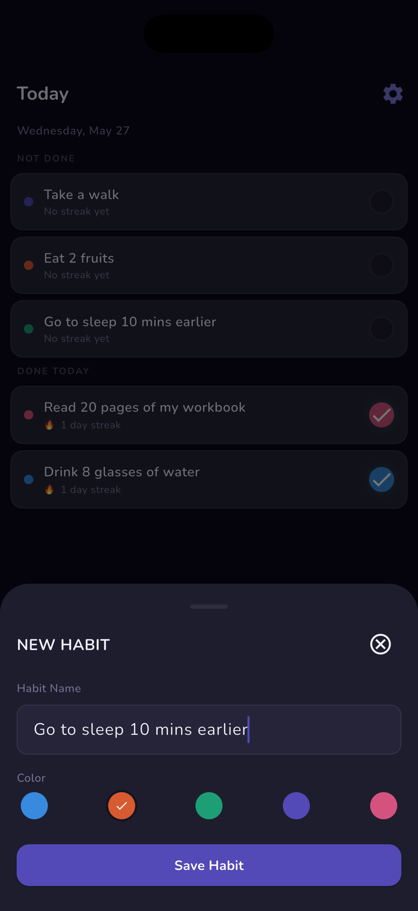 | 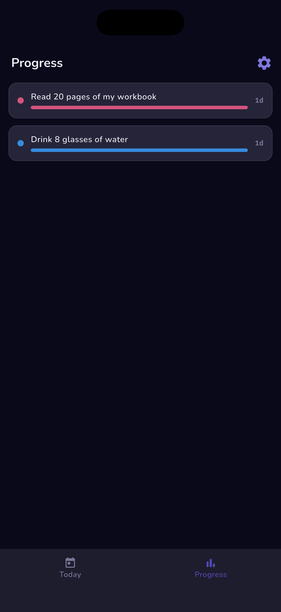 |
| **Android** | 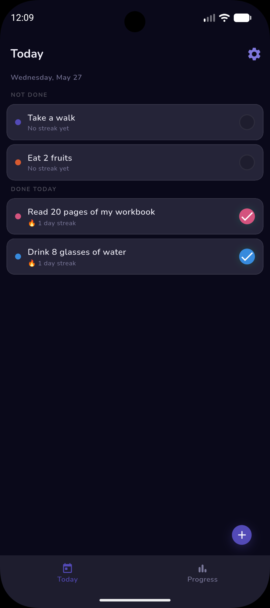 | 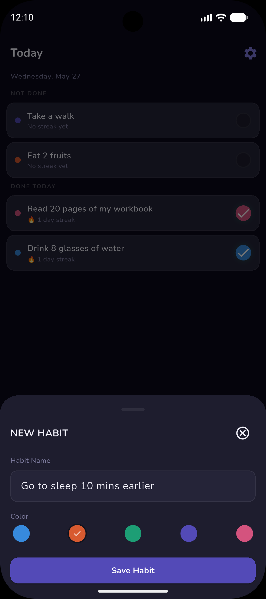 | 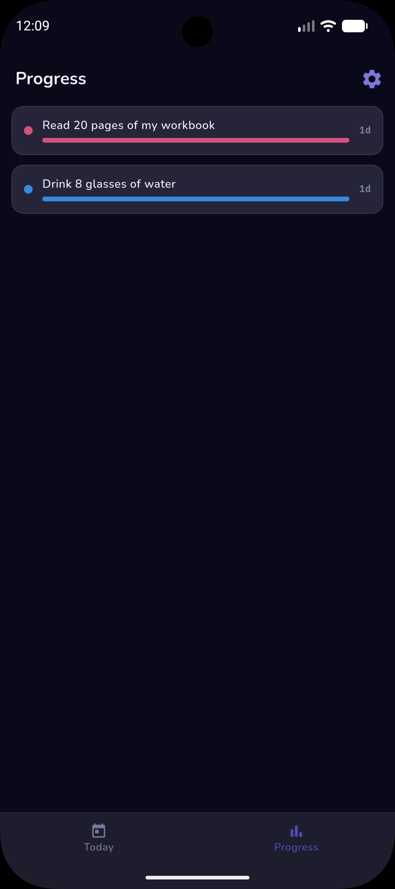 |

## Features

- ✅ Track daily habits and maintain streaks
- ✅ Color-coded habit cards for quick visual scanning
- ✅ Separate "Not Done" / "Done Today" sections, updated in real time
- ✅ Add, edit, and delete habits via a BottomSheet with name and color picker
- ✅ Progress charts and streak history visualization
- ✅ Dark mode with system default and manual toggle in Settings
- ✅ Polished splash screen on iOS and Android (including Android 12+ adaptive splash)
- ✅ Custom launcher icons across both platforms
- ✅ Daily reminder notification with OS permission handling and graceful denial UX
- ✅ Fully offline — no account or login required
- ✅ Cross-platform: iOS and Android from a single codebase
- ✅ Tested — unit tests (streak logic, allHabitsDoneToday getter, toggle transition), widget tests (HabitCard, ProgressCard, TodayScreen, ProgressScreen, SettingsScreen, AddEditHabitBottomSheet), and data layer tests via flutter_test and mockito

## Tech Stack

| Layer | Choice | Notes |
|---|---|---|
| Language | Dart / Flutter | SDK `^3.44.0` |
| State management | Provider | MVVM — `HabitViewModel` and `SettingsViewmodel` are the sources of truth |
| Persistence | sqflite + shared_preferences | SQLite for habits, shared_preferences for settings |
| Fonts | Nunito (Google Fonts) | 400 / 500 / 600 / 700 weights |
| Splash | flutter_native_splash | Android 12+ adaptive splash configured |
| Icons | flutter_launcher_icons | 1024px source icon |
| Notifications | flutter_local_notifications + timezone + flutter_timezone | Scheduled daily reminder; OS permission request with denial UX |

## Architecture

MVVM using Provider. `HabitViewModel` extends `ChangeNotifier` and is the single source of truth for habit state. `SettingsViewmodel` manages user preferences including theme and notification settings, persisted via shared_preferences. Screens consume viewmodels via `context.watch` — no business logic in widgets. Persistence is handled by sqflite through a dedicated repository layer, keeping the data layer cleanly separated from the UI. Theming uses Flutter's `ThemeExtension` with a custom `AppColorTokens` class providing light and dark token sets.

```
habittrack/
├── assets/
│   ├── fonts/          # Nunito 400–700, FiraCode 500–700
│   ├── icon/           # 1024px launcher icon source
│   ├── images/
│   └── splash/         # Splash assets, Android 12+ adaptive
├── docs/               # README screenshots
├── lib/
│   ├── core/
│   │   ├── constants/     # Colors, tokens, text styles, dimensions, strings, theme
│   │   ├── notifications/ # NotificationService (scheduling) + NotificationHandler (tap routing)
│   │   └── utils/         # Helper utilities, context extensions
│   ├── data/
│   │   ├── database/   # DatabaseHelper (sqflite)
│   │   ├── models/     # Habit
│   │   └── repositories/
│   ├── viewmodels/     # HabitViewModel, SettingsViewmodel (ChangeNotifier)
│   └── views/
│       ├── add_edit_habit/ # AddEditHabitBottomSheet
│       ├── settings.dart   # SettingsScreen
│       └── home/           # HomeScreen (IndexedStack): TodayScreen, ProgressScreen
│           └── widgets/    # HabitCard, ProgressCard, TodayScreen, ProgressScreen, TodayPlaceholder, ProgressPlaceholder
├── test/
│   ├── data/
│   │   ├── models/         # Unit tests: Habit.computedStreak logic
│   │   └── viewmodels/     # Unit tests: HabitViewModel streak logic, allHabitsDoneToday getter (mockito)
│   └── views/
│       ├── add_edit_habit/ # Widget test: AddEditDeleteHabitBottomSheet
│       ├── settings_test.dart  # Widget tests: SettingsScreen
│       └── home/
│           ├── progress_screen_test.dart  # Widget tests: ProgressScreen
│           └── widgets/    # Widget tests: HabitCard, ProgressCard, TodayScreen
├── README.md
└── pubspec.yaml
```

## Alternate Implementations

- [Riverpod](https://github.com/eomapps/habittrack_flutter/blob/feature/riverpod/README.md) — same app re-implemented with `flutter_riverpod` using `StateNotifier` and `Notifier`

## Getting Started

### Prerequisites

- Flutter 3.x / Dart 3.x
- VS Code with the [Flutter extension](https://marketplace.visualstudio.com/items?itemName=Dart-Code.flutter)
- Android SDK via Android Studio (emulator / device builds)
- Xcode (macOS only — required for iOS simulator and device builds)

### Clone & run

```bash
git clone https://github.com/eomapps/habittrack_flutter.git
cd habittrack_flutter
flutter pub get
flutter run
```